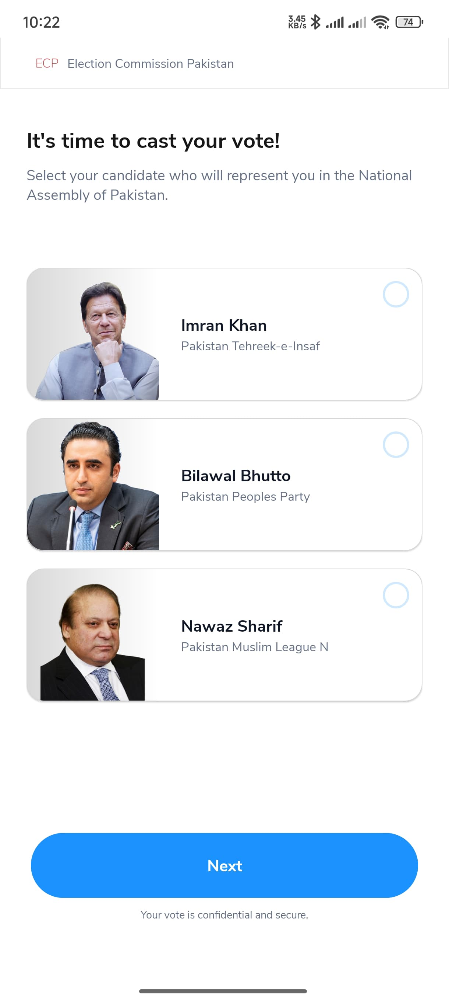
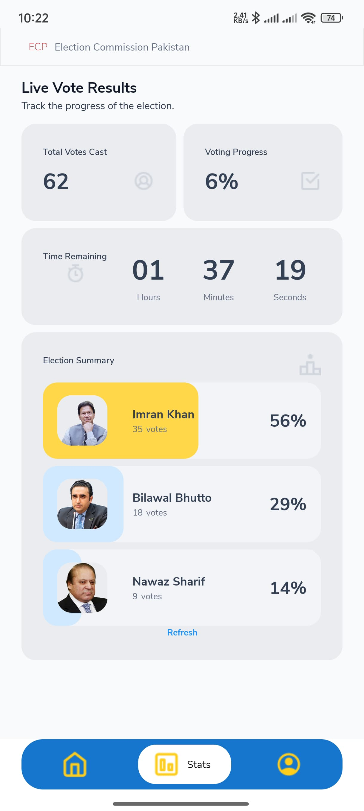

# 🗳️ Votely


[](https://www.linkedin.com/in/kaleem-hassan-61369a214)
[](https://github.com/kaleemhassan/votely)

---

## 📱 Project Overview

**Votely** is a modern and secure voting application built using **Android Studio** and **Firebase**. It enables users to sign in and cast votes for their preferred candidates, ensuring each user can vote only once. The system updates live statistics and displays real-time voting results.

This project was developed as a final year project to simulate a real-world digital voting system, focusing on accessibility, transparency, and usability.

---

## 🎯 Features

- 🔐 **Google Sign-In & Firebase Authentication**
- 👤 **Profile Management** (Name, Email, Language, Logout)
- 🗳️ **Live Voting Panel** – Select and vote for candidates
- 📊 **Real-Time Stats** – Display of total votes, vote percentages
- 🔁 **24-Hour Countdown Timer** – Daily voting reset mechanism
- ✨ **Vote Confirmation** – Bottom sheet with confirmation overlay and animation
- ✅ **Firestore-Backed Vote Tracking** – Each user can vote once

---

## 📷 Screenshots


- **Home Screen**  
  

- **Voting Screen**  
  

- **Vote Confirmation Overlay**  
  

- **Stats Screen**  
  

---

## ⚙️ Tech Stack

| Layer       | Technology            |
|-------------|------------------------|
| Language    | Java                   |
| UI Design   | XML, Material Design   |
| Backend     | Firebase Firestore     |
| Auth        | Firebase Authentication|
| Animations  | Lottie + Custom XML    |

---

## 🚀 How to Run

1. Clone this repository:
   ```bash
   git clone https://github.com/kaleemhassan/votely.git
   
Open the project in Android Studio.

Add your own google-services.json file inside the app/ directory.

Sync Gradle.

Run the app on an emulator or real device.


This app was developed as part of our academic project.


🤝 Connect With Me

📫 Email: kaleemhassan.dev@gmail.com
